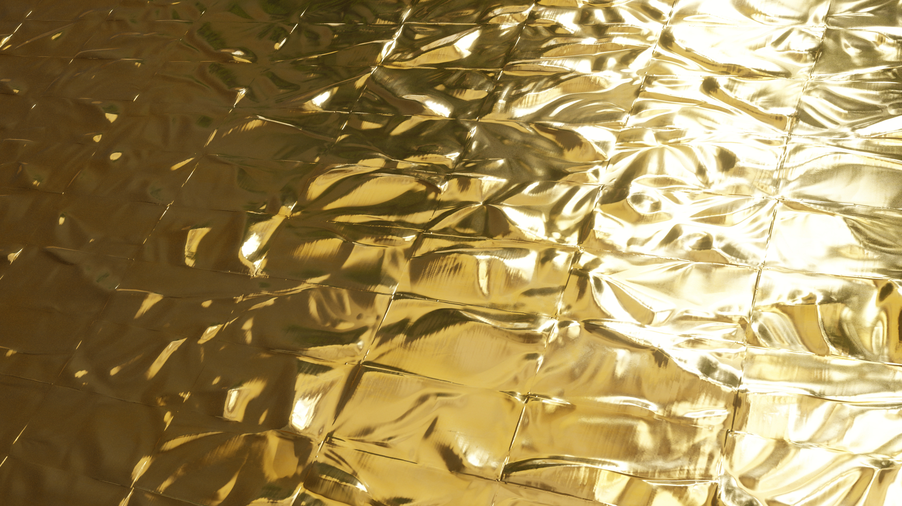
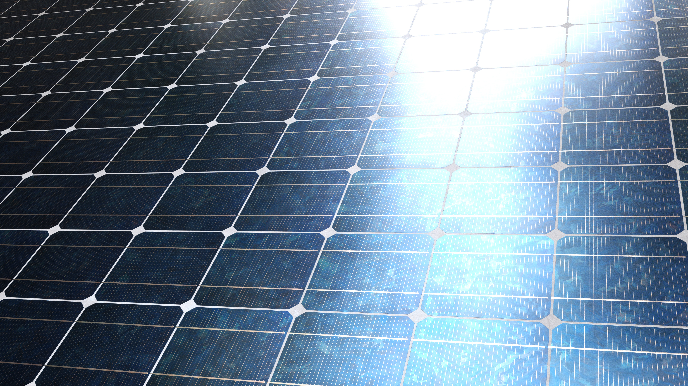

<em><h1>Important: Upon further looking through the playlist of the Aframe Tutorial there will be only 27 availability of video's, since the other 13 video are hidden by the creator</h1></em>

# Tool Learning Log

## Tool: Aframe

---

## 2/24/25+3/3/25:First Tool learning log

  <ul>
  <li>Finalized on the tool Aframe</li>
  <li>Installed/Put in the code that is require in order for Aframe to work for my IDE through the <a href= "https://aframe.io/docs/1.7.0/introduction/"> Aframe Website</a></li>
  <li>Have a little bit of time lefted in class,started watching through the playlist of Aframe Tutorial's ranging from least complex-->most complex.
    <a href="https://www.youtube.com/watch?v=ktjMCanKNLk&list=PL8MkBHej75fJD-HveDzm4xKrciC5VfYuV">The playlist of the aframe tutorials</a></li>
  You can create any shape by using the:

     <a-(shape)> , </a-(shape)>. Like, <a-box>, </a-box> and <a-cylinder>,</a-cylinder>
  <li> Was very fun see to see different shapes and the fact you can see the whole thing of the shape since by doing http-server it gives you 360 view meaning you can rotate it however you want.</li>
  <li> Changed colors of the shape, changed box color from white-->blue. Also changed the width and the height to both 5 and 3.</li>
  <li>Final result of the blue box looks weird but I guess progress is progress</li>
  <li> Final conclusion 2/41 tutorial of Aframe watched. </li>
  <li>Next learning log hoping to cover 2 videos for Aframe tutorial</li>
</ul>

### 3/11/25: Second Learning Log
<ul>
  <li>Starting from the video <a href="https://www.youtube.com/watch?v=liOLtcPmMa0&list=PL8MkBHej75fJD-HveDzm4xKrciC5VfYuV&index=4"> Position And Relative Positioning</a></li>
<li>There is the positioning where there's 3 values.</li>
<li>One is the x value, one is the y value and the last one is the z value</li>
<li> Also something I learned from the video is that Aframe apparently uses the "right hand coordinate system"</li>
<li> And this system focuses kind of on the camera angle. The x being like the thumb and the y being the pointy finger, and the z being the third finger.
I won't get that much in detail but if you would like to know more watch the video.</li>
<li> Some examples I did were:</li>

             <a-box color= "skyblue"
            height="3"
            position="0 10 0"
            width="2"
            length="1.5">

          </a-box>
          <a-cone color="red">

          </a-cone>
          and
           <a-box color= "skyblue"
            height="3"
            position="20 0 0"
            width="2"
            length="1.5">

          </a-box>
          <a-cone color="red">

          </a-cone>
<li>As for the example above, you seen that I changed the y position first, and when I tested it it made the box I made go up.</li>
<li>I put a cone because I wanted to see what direction would the box</li>
<li>If changed y it seems to go --> up, and when I changed x position it seems to go --> infront, however for the z value I did test it but I couldn't really figure out which way since when I set it to 10, it just go the same direction as x </li>
<li>For the final product for positioning regularly I just made:</li>

       <a-box color= "skyblue"
            height="3"
            position="10 2 -5"
            width="2"
            length="8"
            depth="0.3">
          </a-box>

          </a-box>
          <a-cone color="red">
<li>Which from my POV, I reload the page and when I try to find my box it was to the left side of the cone</li>
<li>This is the final result I did for this video:</li>

         <a-box color= "skyblue"
            height="3"
            position="10 2 -5"
            width="5.5"
            length="20"
            depth="0.2">
            <a-circle position="1 0 0.111"
                      color="orange"
                      side="double">
                    </a-circle>
                    </a-circle>
            </a-circle>
          </a-box>

          </a-box>
<li>Just to clearlifed that there is a circle right underneath and inside the box is so that this positioning and the css for the circle is connected to the box. Because the final result of this should be the orange circle sticking right onto the green box.</li>
<li>Also if you're curious there is a "double" code I put, the double code allows it so that the shape can be viewed at both side, so basically if you can see it at the right side, you can also see it on the left side</li>
<li>Ending off, I say this is some good progress but this video did have lot's of information since it was 9 minutes long</li>
<li>Next learning log hoping, to finish at least 2 and a half video, since the next one is 4 minute but the one after that is 20 minutes long</li>
<li>No questions I have nor do am I struggling on anything</li>
<li>Small correction its 4/41 video since, 2 were introductions video and the other 2 is the real lessons</li>

</ul>

### 3/17/25: Third Learning Log
<ul>
  <li>Starting from the video <a href="https://www.youtube.com/watch?v=Kt5c3Z8odAo&list=PL8MkBHej75fJD-HveDzm4xKrciC5VfYuV&index=6">Rotation And Relative Positioning</li>
    <li>I know what you're wondering. "This is the same isn't it?" Well not quite, its different last one was focused on relative positioning, but now its relative rotation. These are 2 seperate thing</li>
    <li>Apparently, the same thing with the relative positioning, it also follows the right hand thumb rule</li>
    <li> From my understanding of the rotation code, the following:</li>

            if you do changed the x value of the rotation; like rotation="10 0 0" it changed the item/object like slanted.

<li>Use the following image as reference,<a href="rotationm.jpeg">Reference</a> Look at the demonstration at the end of the image where it shows x, that's basically what happen to my object after I change the X position</li>
<li>Now moving on to changing the y positioning:</li>

            if you do changed the y value of the rotation; like rotation="0 10 0" it changes like also slanted like the x value changes but different way refer to the middle of the image as demonstration

<li>For some reason when I changed the y value the shape of my square only seem to be moving like forward like not slanted. I'm not sure the reason why but I think it might have to be something to do with the open spaces</li>
<li> So I tested it again with the x value added in</li>

              rotation="40 10 0" I tested between both 10 for y value and 30 for y value. And yea the shape seems to be moving forward from my starting point of the camera

<li>Changing the z position makes it so that apparently the shape/object is moving towards like to the right?, I don't know how I can clearly explain this but from my POV my camera when I changed from 10-->40 z positioning value, the object is more and more turning its side. This is kind of confusing since when I try with 100 for z positioning its different again? I'm not sure if these have a stable value and a stable like movement?? Also refer to the first image in the reference as demonstration </li>
<li>Codes here</li>

              rotation="40 10 10" --> (shape turning side) rotation="40 10 40" --> (turning more)rotation="40 10 70" -->(I thought it completely flip itself over but apparently not?
              rotation="40 10 100" (Can't describe this shape)

<li>Moving on to the next video tutorial <a href="https://www.youtube.com/watch?v=K4LEMBjaV9E&list=PL8MkBHej75fJD-HveDzm4xKrciC5VfYuV&index=6">"Scale, Relative Scale, And Reflection"</a></li>
<li>Likewise, with the scaling code, it also has 3 positions. The x, y, and z. However I think changing the value are different.</li>
<li>Code used</li>

               <a-cylinder color="skyblue"
      height="2"
      radius="2"
      segements-radial="6"
      open-ended="true"
      side="double"
      position="0 1 0"
      rotation="0 -90 90"
      scale="2 1 0">
    </a-cylinder>
    *This code is from the video tutorial*
<li>Okay so for the scaling code to work, I actually had to put 1 for the y value. The reason being apparently if you set it to 0 you cannot see like its straight out flat. Well that's what I saw on my end so result may differ. The x value doubles the shape size??? Because I kept the y value at 1 and changed the x value from 1-->2-->5 and it becomes longer and longer as a flat bed. Not sure if that's right</li>
<li>When I changed the y position the shape of apparently widens itself? Because I put the same code for y value also and refreshed everytime and the flat bed double.</li>
<li>Okay so I'm sure what's entirely going on for the z value because when I put one that flat bed of my shape, becomes a oval??? The bigger the number that I had apply to the z value its become more oval and oval like its getting bigger and fatter. But all these value have something to do with the positoning also.</li>
<li>Next learning log I'll be finishing up this video and diving a-bit more deeper</li>
<li>End result:Half way through the video, still a-bit confusing but continuing to practice on my IDE</li>
<li>6.5/41 videos covered</li>

</ul>

### 3/24/25: Fourth Learning Log
<li><em>Continuing  off from learning three</em></li>
<li>In the video, at the <a href="https://youtu.be/K4LEMBjaV9E?si=MXRhnvJNGYGQ9uDu&t=170">2:50 video mark</a> there is a 3D representation of the right thumb hand rule. It goes in more deeper to the x y and z positions.</li>
<li>TLDR;Basically for the rest of the video he continues to explain more about the x y and z postioning base on visual and 3d representation</li>
<li>Starting at <a href="https://www.youtube.com/watch?v=XUwvKXPlnJY&list=PL8MkBHej75fJD-HveDzm4xKrciC5VfYuV&index=7"> "Images textures and Materials".</a></li>
<li>For in order to put images/textures into your desire object, of course you have to download them first. In the video, he mentioned a very useful website where you can download textures. <a href="https://www.textures.com/">Go here to download the textures.</a></li>
<li>Although this website is free <em>Some of the textures are preminum meaning not free</em></li>
<li>Putting texture on an object is simple to be honest. In my case I downloaded 3 texture to test it out. I downloaded an texture of an solar cell, an texture of an gold blanket, and a pavement painted concrete. </li>
<li>If you want to see the texture out, here: <a href="../img-texture-folder/TCom_SolarCells_header.jpg">Solar Cells</a>,<a href="../img-texture-folder/TCom_Pavement_PaintedConcrete3_header.jpg">Pavement Concrete</a>, and lastly <a href="../img-texture-folder/TCom_Plastic_SpaceBlanketFolds_header.jpg">Plastic Space Blanket</a></li>
<li>To be fair and honest, putting texture on an object is easy. All you have to do is basically upload the texture file on the github repoistory's and put:</li>

              src="TCom_SolarCells_header.jpg" (or whatever you named your texture)

<li>For example, I downloaded and uploaded 3 texture which I assume you have already seen. But how does that look in Aframe? Well</li>

             <a-cone color="white"
       src="../img-texture-folder/TCom_SolarCells_header.jpg"
       width="4" height="4" depth="4"
       position="-2 1.5 -9">
      </a-cone>

      <a-box color="white"
      width="4" height="4" depth="4"
      src="../img-texture-folder/TCom_Plastic_SpaceBlanketFolds_header.jpg"
      position="-2 1.5 -4">
     </a-box>

     <a-cylinder color="white"
     src="../img-texture-folder/TCom_Pavement_PaintedConcrete3_header.jpg"
     width="4" height="4" depth="4"
     position="-2 1.5 1">
    </a-cylinder>
<li>You can see there's a different shape for the texture. I know you can't see what it actually look like, but you can already get some idea from the code itself.From my perspective, the cone has the solar cell which I don't think its the best fit. The box has gold alike stuff. It looks like a golden box. And the cylinder has the concrete and I think it fits perfectly because it represents a stand like those thing you would see in a fancy building.</li>
<li>Okay, so according to the video, that section was focused on texture, now for material its kind of complicated I rewatched the video 3+ for that section and I still don't understand it. But basically there is something called the <em>Normal Maps</em></li>
<li>According from google, one of the sources normal maps is the following <strong>"Normal maps are a type of Bump Map. They are a special kind of texture that allow you to add surface detail such as bumps, grooves, and scratches to a model which catch the light as if they are represented by real geometry."</strong> The name and the function align up but it is what it is. I actually tested this code partially in my IDE.</li>

                
     <a-box color="white"
     src="../img-texture-folder/TCom_Plastic_SpaceBlanketFolds_header.jpg"
     width="4" height="4" depth="4"
     repeat="1 1"
     normal-map="#Gold"
     normal-texture-repeat="1 1"
     normal-scale="1 -1"
     roughness="0.1"
     position="-2 1.5 -4">
    </a-box>

<li>So one thing I noticed when I add the normal map related stuff is that, there is reflection and bumpness among my texture. Because when I look around the box very closely there is light reflecting off of the texture. And when I look closely I can also seem how rough or smooth the texture is.</li>
<li>Also if you want to try this, make sure to add:</li>

            <a-assets>
      
    </a-assets>

<li><em>Give an id and search for the src</em></li>
<li>For the rest, since I don't exactly know how to explain the material stuff I recommend you to watch the material section part of the video <a href="https://youtu.be/XUwvKXPlnJY?si=rNGjIgjuQN4LBNPp&t=403">Second Section</a></li>
<li>Moving on, to the next video, I'm going to actually do some skipping around here, starting at <a href="https://www.youtube.com/watch?v=Qv1PYATnsl0&list=PL8MkBHej75fJD-HveDzm4xKrciC5VfYuV&index=10">"Ground"</a></li>
<li>This video basically talks about the ground pretty much. Like I'm serious, its all about g-ro-und...</li>
<li>Basically all you're creating is the ground, with codes to make the ground have texture and having reflection and stuff related to normal maps.</li>
<li>My code for testing this:</li>

                  <a-assets>
      
    </a-assets>
    <a-scene>
    
            <a-plane material="color: #FFFFFF;
          src: ../img-texture-folder/TCom_Pavement_PaintedConcrete3_header.jpg"
          repeat:3 1;
          normal-map: #concrete-NRM;
          normal-texture-repeat: 3 1;
          rotation="-90 0 0"
          scale="20 20 4">
            </a-plane>

<li>Pretty self-explanatory to be honest. Just a flat out floor with the concrete texture and I think there is some reflection. </li>
<li>That's all, uh no question but there are lot's of concern</li>
<li>Some unanswered concern: What is really the concept of normal map? (Still don't quite understand it)</li>
<li>Next learning log hoping to cover fully 1 and a half video because its 19 minute long for the second video</li>
<li>8/27 video covered</li>

### 3/31/25: Fifth Learning Log
<li>Starting off at <a href="https://www.youtube.com/watch?v=tzI5tu-0nm0&list=PL8MkBHej75fJD-HveDzm4xKrciC5VfYuV&index=11">Sky and 360 Image</a></li>
<li>Overall, summary basically is like a contiunation of the previous video, but instead of ground its the sky. I found the sky code more interesting. I wish I could show what the preview look like but I can only describe it.</li>
<li>I used the solar cells for my sky, and to be frankly, the sky looked like a huge dome with my brick plate. The sky's shape is also like spiral, because the texture of the solar cells is moving in a spiral direction from top to bottom, bottom to top</li>

                          <html>
                          <head>
                          
                            </head>
                            <body>
                          <a-assets>
                          
                        
                          </a-assets>
                        <a-scene>
                          <a-sky src="../img-texture-folder/TCom_SolarCells_header.jpg">
                              </a-sky>
                          <a-plane material="color: #FFFFFF;
                          src: ../img-texture-folder/TCom_Pavement_PaintedConcrete3_header.jpg"
                          repeat:3 1;
                        normal-map: #concrete-NRM;
                          normal-texture-repeat: 3 1;
                          rotation="-90 0 0"
                        scale="20 20 4">
                        </a-plane>

<li>The spiral siutation may <em><strong>VARY</strong></em> because in the video, the coder used an image of an sky, so maybe that's the reason why</li>
<li>By using the </li>

                raidus="" code you can change how big or small you want the sky to be. In the video he changed the sky because, he mentions how his sky were to big and if someone were to view this, some would be afraid of heights therefore he changed it 

<li>I did mine in order to see what's the difference</li>

                    <a-sky src="../img-texture-folder/TCom_SolarCells_header.jpg"
                      radius="10">
                        </a-sky>
                      </a-sky>
<li>1/2 size compared to my concrete plate</li>

                          <a-scene>
                          <a-sky src="../img-texture-folder/TCom_SolarCells_header.jpg"
                            radius="15.5">
                            </a-sky>
                            </a-sky>
                      <a-plane material

<li>Fully covers my concrete plate but over by like 2.5 radius</li>
<li>Also added the "side="double" code so that when I look from an different angle I don't just see the inside of that sky like an curved hollow</li>
<li>And lastly of course if you want to fill like you want to make it so you are on a piece of land, change the scale of your ground to 10000 and 10000 but do becareful that sometimes the texture may be stretched too far to the point where the texture is very smudghed and weird, depending on the texture you use.</li>
<li>And for the 360 VR preview you have to download an 360 sky from an website basically</li>
<li><em><strong>That's all for this learning log, I know I know this learning log is shorter than the previous one's and I promise to finish the 19 min video. However I couldn't because I had another homework to do. I apologize. But you can see the 19 min in the next learning log, also planning to revise the whole learning log so you don't have to scroll for an eternity when you want to find the newest learning log</em></strong> </li>
<li>9/27 videos covered</li>
                  
<!--
* Links you used today (websites, videos, etc)
* Things you tried, progress you made, etc
* Challenges, a-ha moments, etc
* Questions you still have
* What you're going to try next
-->
